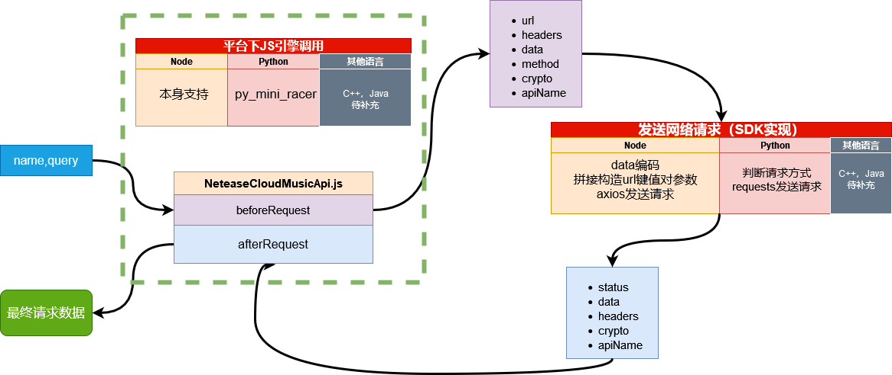
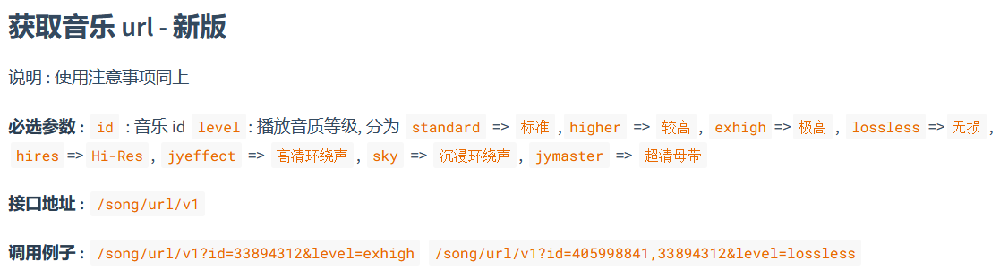

## SDK 开发指南

### SDK工作流程
> corejs已经被打包成了ESM, 资源位于`./dist/NeteaseCloudMusicApi.js`
>
> 各SDK需要使用本平台下的Js引擎执行`NeteaseCloudMusicApi.js`调用它的`beforeRequest`和`afterRequest`俩个方法并自己实现网路请求相关内容



### 入参和出参

#### beforeRequest
> query接受俩种类型：对象和json字符串，传入对象返回也是对象，如果传入json那么就会返回相应json字符串结果
```
NeteaseCloudMusicApi.beforeRequest(name: str, query: object|json_str)
-> name: str, query: object   
    :@return: object    {url, headers, data, method, crypto, apiName}
-> name: str, query: json_str 
    :@return: json_str  "{url, headers, data, method, crypto, apiName}"
```

> 补充：给beforeRequest传入的参数中，
>
> name为接口的名字, 例如`song_url_v1`或者`/song/url/v1`这两种格式均支持。
>
> query是对应的参数，但必须传入`realIp`和`cookie`，对应到上面接口就是
>
> ```{id:"33894312", level:"exhigh", cookie:"你的cookie"，realIp:"你的ip或者符合ip格式的任意字符串"}```
>
> 这里需要注意的是所有的值均需要传字符串，比如这里的id虽然是一个数字但你要传字符串格式的数字
>
> 

具体的api名字和参数见文档：[文档地址](https://docs.neteasecloudmusicapi.binaryify.com/#/)

#### afterRequest

> responseResult接受俩种类型：对象和json字符串，传入对象返回也是对象，如果传入json那么就会返回相应json字符串结果
```
NeteaseCloudMusicApi.beforeRequest(responseResult: object|json_str, crypto: str, apiName: str)
-> responseResult: object, crypto: str, apiName: str
    :@return: object    {code, data, msg}
-> responseResult: json_str, crypto: str, apiName: str
    :@return: json_str  "{code, data, msg}"
```

> 补充：在afterRequest接受的三个参数中，
>
> crypto和apiName均来自于beforeRequest的返回值。
>
> responseResult是网络请求的返回值中的status，data和headers所构成的对象，或Json字符串。形如：
>
> ```{"status": response.status, "data": response.data, "headers": response.headers}```

### 开发流程

掌握了上述的`beforeRequest`和`afterRequest`的使用方法对于绝大部分的接口来说已经足够了，但是任然有一些操作碍于js的限制需要你自己来实现，最简单的一个例子就是项目官方给出的`node`版中是不需要用户自己管理cookie和realIp的。

下面内容是写给想要为NeteaseCloudMusicApi开发新语言平台SDK的工作者的一些建议。

如果您需要平台的SDK暂时还没有人开发，需要在项目中直接使用`NeteaseCloudMusicApi.js`那么下面的内容对您也会有一定的帮助，并且我们由衷希望在这种情况下，如果您有能力和时间，还请帮助我们开发相应开源SDK。

#### 基本结构

如您所见，`cookie`和`realIp`俩个参数是每次都需要传入，另外我们还需要处理cookie过期，游客登录等等的问题，为了程序的可读性，在开发SDK时我们建议您可以将这些操作封装在SDK的内部

在示例中我们假设，SDK暴露一个类（暂且叫作`NeteaseCloudMusicApi`），他下面可以有下面几种方法和属性

- 构造器
- request
- get_local_ip
- cookie的getter和setter
- ip的getter
- call_api

#### 构造器

构造器用来初始化NeteaseCloudMusicApi的初始属性，具体包括：

- 用来执行JavaScript的相关引擎的实例对象：ctx
- 储存cookie字符串的：cookie
- 保存当前ip字符串的：ip
- 判断是否开启调试模式的标识：DEBUG

#### request方法

这个方法是我们希望类``NeteaseCloudMusicApi``暴露给用户的方法

```
request(name: str, query: object = None)
```

他应该有俩个入参，name和query。并且query还应当设置默认值为空，来避免后续出现使用不需要参数的接口时频繁传入空值的问题。

在内部request应该执行的操作包括校验name的合法性，将cookie和realIp加入查询参数query中。

特殊的他还应该判断这个接口是否是一个特殊的接口（后续说明），不是的话调用`call_api`传入`name`和`query`并将结果返回

#### get_local_ip

获取设备ip的方法，我们将他封装到类`NeteaseCloudMusicApi`内部，来让后续使用更加清晰便捷

#### cookie的getter和setter

之所以我们为cookie设置getter和setter而不是直接使用成员变量，一来是因为我们不希望用户直接操作这个值，另外我们还需要在访问这个值和设置值前绑定一些操作

在获取cookie这个值前，我们应该检查这个值是否不存在，如果不存在的话应该读取`cookie_storage`(之前保存cookie的文件)中的cookie将其返回，这个`cookie_storage`文件也不存在的话则应该返回空字符串。

即当前cookie没有值，并且没有之前保存好的cookie时返回空字符串

在读入`cookie_storage`内的cookie时我们还应该检验cookie是否过期，如果过期的话也应该返回空字符串。

具体检测方法是你应该在保存cookie的时候一起保存创建他的时间戳，在使用时计算时间差，超过1296010秒（15天）即视作过期

更好的方法是在判断超过某个值但又未过期前内部调用接口来刷新cookie，而不是不断需要用户登录来重新获取cookie，例如你可以在时间差大于86400秒（1天）时调用`login_refresh`来更新cookie（这里还需要注意的是login_refresh给到的cookie是不完全的你应该对比登录获取的cookie值有选择的更新某些键值而不是直接替换原有cookie）

接下来说到cookie的setter

在设置新的cookie前你应该检查他的合法性，并注意将通过的cookie写入`cookie_storage`文件方便下次使用

#### ip的getter

ip的getter只负责一件事情，如果使用时ip成员变量不存在，调用类方法get_local_ip设置ip后返回

#### call_api

在这里利用之前构造器初始化的js引擎ctx执行`NeteaseCloudMusicApi.js`俩个方法，并进行网络请求

我们分别给出`Python`，`Node`和`Java`环境下的简单示例：

```python

```


```Node

```


```Java

```

### 特殊接口

> 上述说明request方法的时候我们提到了有一些特殊的接口，遇到这些接口时需要您在`NeteaseCloudMusicApi`内部额外编写函数来处理一些特殊操作

#### playlist_track_all

这个接口原作者设计原理是在内部先调用`/playlist/detail`这个接口，之后处理返回的数据，也就是说，`/playlist/track/all`依赖于`/playlist/detail`接口返回的结果.

而`NeteaseCloudMusicApi.js`的设计逻辑不方便做到一个接口里发送俩次请求，所以使用`/playlist/track/all`前你需要先调用`/playlist/detail`然后将返回结果作为`/playlist/track/all`的结果

**参数**: 

detail_result 和 trackIds 参数二选一（需要编码为 json 字符串输入）
		`detail_result`: `/playlist/detail`这个接口直接返回的数据，编码为 json
		`trackIds`: `/playlist/detail`返回数据中的`playlist.trackIds`，编码为 json

二者都传入优先`trackIds`
**示例**

```js
// 先请求 /playlist/detail
let request_param = api.beforeRequest('/playlist/detail', {
  "id": "24381616",
  cookie: cookie,
  realIP: getLocalIP(),
});

const response = await axios({
  method: request_param.method,
  url: request_param.url,
  data: request_param.data,
  headers: request_param.headers,
});

let response_result = {
  headers: response.headers,
  data: response.data,
  status: response.status,
};

let result = api.afterRequest(
  JSON.stringify(response_result),
  request_param.crypto,
  request_param.apiName
);

// 请求/playlist/track/all

let request_param2 = api.beforeRequest("/playlist/track/all", {
  detail_result: JSON.stringify(result), // 直接传入结果
  trackIds: JSON.stringify(result.data.playlist.trackIds), // 拿到trackIds传入， 这里俩个都使用优先trackIds
  cookie: cookie,
  realIP: getLocalIP(),
});

const response2 = await axios({
  method: request_param2.method,
  url: request_param2.url,
  data: request_param2.data,
  headers: request_param2.headers,
});

let response_result2 = {
  headers: response2.headers,
  data: response2.data,
  status: response2.status,
};

let result2 = api.afterRequest(
  JSON.stringify(response_result),
  request_param.crypto,
  request_param.apiName
);

console.log(JSON.stringify(result2, null, 4));
```

#### login_cellphone

这是登录的接口您应该在将他的结果返回前调用cookie的setter更新cookie

#### login_refresh

这是刷新登录状态的接口，您应该在将他的结果返回前更新cookie的值

### 总结

经过上述的步骤，您拥有了一个简单的封装的类，他的结构类似

```
NeteaseCloudMusicApi

	成员属性：
		ctx
		cookie
		ip
		DEBUG
	
	成员方法：
		构造器 (方法)
		request (方法)
		get_local_ip (方法)
		cookie (getter方法)
		cookie (setter方法)
		ip (getter方法)
		call_apit (方法)
		playlist_track_all (方法)
		login_cellphone (方法)
		login_refresh (方法)
```

### 后续

NeteaseCloudMusicApi类已经可以看作是一个封装较为完善的SDK，除了将他开源到github外你还可以将他发布到平台下通用的包管理平台来方便他人使用。

你还可以为他添加诸如缓存的功能（让调试接口不必一直发送网络请求）来让他更加完善

此外你还应该为你的项目仓库添加workflow来监控原仓库的更改并定期进行自动同步，来保证你的SDK内部所使用的`NeteaseCloudMusicApi.js`是最新版本